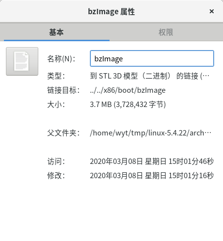
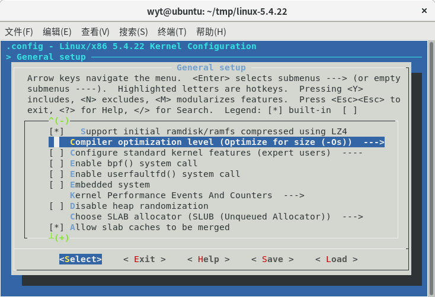
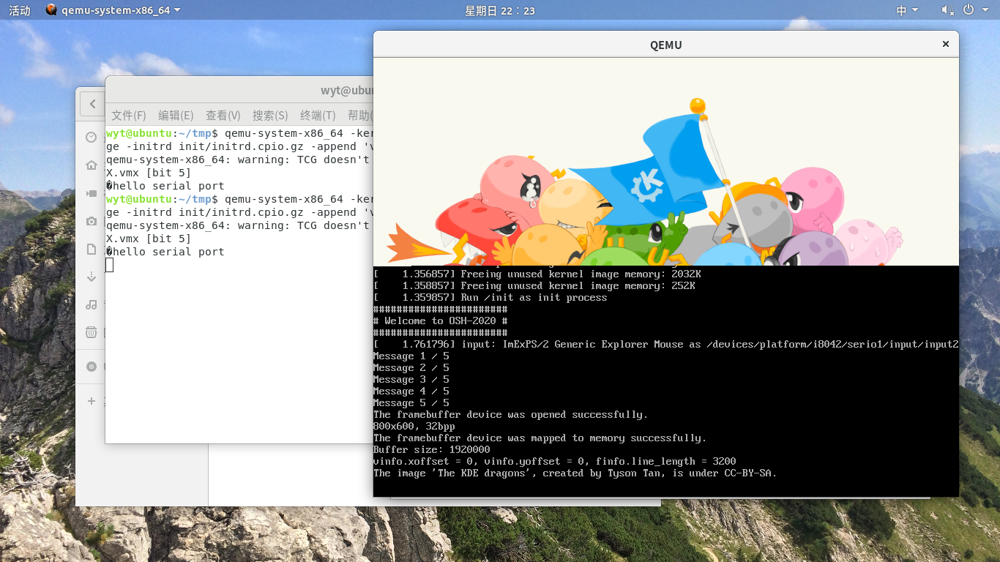
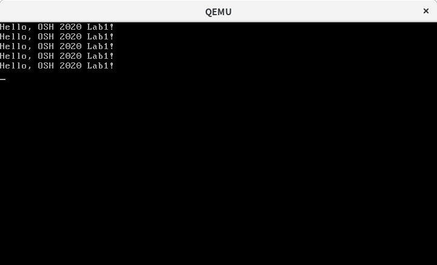

# Lab1 Report

## PB18111684 吴钰同

### 一.编译Linux内核并在QEMU中测试

#### **1.未经裁减直接编译**


屏幕上有输出，说明编译成功。

#### **2.裁减linux内核至不超过8MB**

General setup->Compiler opimization level

关闭O2优化，内核缩小为7.7MB。



#### 3.在2的基础上，裁减linux内核至不超过4MB

General setup： 关闭uselib syscall,auditing support,cpu isolation,control group support,namespace support,profiling support

Processor type and features：只保留第一项，kexec system call等关键选项，其余全部关闭。

Power management and ACPI options：只保留第一项。

Bus options：关闭。

Firmware Drivers：只保留第二项。

Virtualization：关闭。

General architecture-dependent options：全部关闭。

Enable the block layer：只保留第一项。

Device Drivers：把我认识的设备中没用的都关闭了。

Security options,Cryptographic API,Kernel hacking：全部关闭。

最后裁减到3.7MB。



建议：我本来想在网上找有没有内核配置的手册来解释每个选项的意思，但是找到的都是较早版本的内核配置，而一个个选项去查help又有点太浪费时间了，最后我不断尝试出了一些选项是可以去掉的，而它们到底是什么意思还是没弄明白。希望助教能给出一个最小内核的裁减方案以及关键配置的含义。

### 二.构建初始内存盘

#### 1.测试initrd


由于输出信息较多，"Hello Linux!"会被刷掉，在printf后面增加了一句getchar()。

#### 2.init能够依次成功执行程序1、2、3，且程序3执行完成后不出现内核恐慌。

一个程序执行三个其他程序，我首先想到用system函数，但是由于内核还没init，没有bash，不能调用命令行。查阅资料知可以通过fork()创建子进程，然后用execl()让其他可执行文件代替子进程。但是这样写会导致三个文件是并行的，最后图片会和文字同时显示。又查阅资料知waitpid()函数可以暂停目前进程的执行，直到子进程结束，这样就能让三个程序串行了。最后把getchar()改成pause()使进程暂停，防止由于init程序退出导致的内核恐慌。

代码如下：

```c
#include <sys/types.h>
#include <sys/wait.h>
#include <unistd.h>
#include <stdio.h>
int main(){
	pid_t fpid;
	fpid=fork();	
	if(fpid==0){
		execl("./1","",NULL);
	}
	while(waitpid(fpid,NULL,0)<0);
	fpid=fork();
	if(fpid==0) {
		execl("./2","",NULL);
	}
	while(waitpid(fpid,NULL,0)<0);
	fpid=fork();
	if(fpid==0){
		execl("./3","",NULL);
	}
	pause();
	return 0;
}
```

效果：



### 三、使用汇编语言，编写x86裸金属程序

#### 1.清空屏幕

查阅资料知，程序设定显卡的显示模式时，BIOS中断服务程序会自动地清除整个屏幕，而PC上的显卡显示模式都是3，所以只需要将显示模式设成3即可清屏。要使用10H中断的00H功能。

代码如下：

```asm
mov ah,0x00
mov al,0x03
int 0x10								; call BIOS interrupt procedure, clear the screen
```

#### 2.每隔1秒向屏幕输出一行文字

由助教的提示知需要用到8254计时器，它映射在内存的0x064c位置。只需要再每次循环输出之前先将计时器清零，再循环判断一下计时器是否加到18即可，完整代码如下：

```asm
[BITS 16]                               ; 16 bits program\r
[ORG 0x7C00]                            ; starts from 0x7c00, where MBR lies in memory

sti
mov ah,0x00
mov al,0x03
int 0x10								; call BIOS interrupt procedure, clear the screen


print_str:
 	mov word [0x046C],0					; clear the timer
test_timer:
	cmp word [0x046C],18				; when timer gets 18, print the mess
	jle	test_timer
	mov si, OSH							; si points to string OSH
start:	
    lodsb                               ; load char to al
    cmp al, 0                           ; is it the end of the string?
    je return                           ; if true, then return to the first character
    mov ah, 0x0e                        ; if false, then set AH = 0x0e 
    int 0x10                            ; call BIOS interrupt procedure, print a char to screen
    jmp start                           ; loop over to print all chars

return:
    jmp print_str

OSH db `Hello, OSH 2020 Lab1!\n\r`, 0   ; our string, null-terminated

TIMES 510 - ($ - $$) db 0               ; the size of MBR is 512 bytes, fill remaining bytes to 0
DW 0xAA55                               ; magic number, mark it as a valid bootloader to BIOS 
```

效果：



建议：一开始我用课程主页上的文档的方法声明常量0x046c，结果调了半天都没搞定，那个文档的x86汇编和nasm的语法不同，建议能提供符合nasm的文档。

### 四、思考题

**1.在使用 `make menuconfig` 调整 Linux 编译选项的时候，你会看到有些选项是使用 `[M]` 标记的。它们是什么意思？在你的 `init` 启动之前的整个流程中它们会被加载吗？如果不，在正常的 Linux 系统中，它们是怎么被加载的？**

它们是动态可加载模块的意思，只有当打开loadable module support时才会出现[M]。init启动之前它们不会被加载。这些模块不会被编译到内核中，只是生成.o文件，在正常的linux系统中，我们可以收集这些.o文件做到linux的文件系统中，然后用insmod和modprobe实现动态加载。

**2.在「构建 `initrd`」的教程中我们创建了一个示例的 init 程序。为什么屏幕上输出 "Hello, Linux!" 之后，Linux 内核就立刻 kernel panic 了？**

因为linux的运行依赖于init进程，如果init进程结束，linux就无法运行下去了；而示例的init程序结尾为return 0;，init程序运行终止，所以内核会报错kernel panic。

**3.在 Vlab 平台上，即使是真正的 root 也无法使用 `mknod` 等命令，查找资料，尝试简要说明为什么 fakeroot 环境却能够正常使用这些命令。**

fakeroot是一个shell脚本，当运行fakeroot时会启动faked，获取FAKEROOTKEY，设置环境变量FAKEROOTKEY，LD_LIBRARY_PATH，LD_PRELOAD。其中LD_LIBRARY_PATH，LD_PRELOAD环境变量指定了一个动态链接库（/usr/lib/libfakeroot/libfakeroot-sysv.so），这个动态链接库导出了mknod()等函数，当在fakeroot环境里使用这些命令时，会加载这个动态链接库中的函数。而这个动态链接库是独立于真正的root存在的，所以即使vlab平台上的root没有mknod等命令，也可以通过fakeroot正常使用这些命令。

**4.目前，越来越多的 PC 使用 UEFI 启动。请简述使用 UEFI 时系统启动的流程，并与传统 BIOS 的启动流程比较。**

UEFI启动流程：

1. 系统开机 - 上电自检（Power On Self Test 或 POST）。
2. UEFI 固件被加载，并由它初始化启动要用的硬件。
3. 固件读取其引导管理器以确定从何处（比如，从哪个硬盘及分区）加载哪个 UEFI 应用。
4. 固件按照引导管理器中的启动项目，加载UEFI 应用。
5. 已启动的 UEFI 应用还可以启动其他应用（对应于 UEFI shell 或 rEFInd 之类的引导管理器的情况）或者启动内核及initramfs（对应于GRUB之类引导器的情况），这取决于 UEFI 应用的配置。

BIOS启动流程：

1. 系统开机 - 上电自检（Power On Self Test 或 POST）。
2. POST过后初始化用于启动的硬件（磁S盘、键盘控制器等）。
3. BIOS会运行BIOS磁盘启动顺序中第一个磁盘的首440bytes（MBR启动代码区域）内的代码。
4. 启动引导代码从BIOS获得控制权，然后引导启动下一阶段的代码（如果有的话）（一般是系统的启动引导代码）。
5. 再次被启动的代码（二阶段代码）（即启动引导）会查阅支持和配置文件。
6. 根据配置文件中的信息，启动引导程序会将内核和initramfs文件载入系统的RAM中，然后开始启动内核。 

BIOS运行MBR中的启动代码，而UEFI是加载磁盘中的可执行文件。
